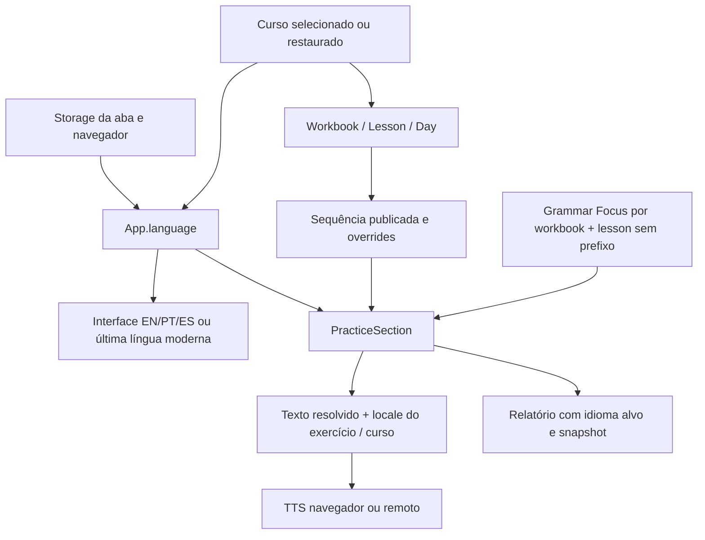

# Auditoria arquitetural — Base Language × Target Language × UI Language × TTS

Data: 02/09/2026. Projeto: Learnendo. Natureza: diagnóstico estático e proposta para aprovação; nenhuma implementação autorizada por este documento.

## 1. Resumo executivo

O Learnendo já reconhece cinco idiomas de conteúdo, mas não possui um contrato independente para o idioma de apoio do aluno. Em `App.tsx`, `language` é sincronizado com o curso e também controla a interface de EN/PT/ES. `BASE_UI_LANGUAGE_STORAGE_KEY` preserva a última língua moderna para a interface de EL/HE; não representa uma preferência de instrução persistida por usuário. Portanto, selecionar espanhol não significa hoje “aprender espanhol com apoio em português”: muda também a interface para espanhol, enquanto parte do apoio continua em português.

Recomendação: separar os contratos e as identidades **antes de ampliar os cadernos multilíngues**. Fazer um piloto vertical com conteúdo pequeno e revisado, mantendo o currículo alvo uma única vez por curso e acrescentando apoio localizado EN/PT/ES. Não é necessário concluir a tradução de todos os cadernos para começar essa separação.

Principais evidências:

- Grammar Focus remove o prefixo de idioma da identidade e compartilha o mesmo documento entre lições equivalentes de cursos diferentes. Esse contrato precisa ser corrigido antes de publicar gramática específica por curso.
- O nivelamento ignora o idioma solicitado, usa o mesmo banco de áudio inglês e grava o resultado sob o idioma selecionado. Há risco concreto de classificar uma avaliação de inglês como avaliação de outro idioma.
- O editor de problemas já prioriza `report.workbookId`, normaliza IDs prefixados e rejeita identidades inválidas. A antiga falha `Livro NaN` não deve ser tratada como pendência desta auditoria. Ainda falta separar curso, idioma alvo e contexto de apoio nos relatórios.
- Battle já possui interface separada, idioma de template e operações explícitas de tradução; contudo o Hub ainda deriva o curso da interface, e o TTS dos jogadores deriva o idioma do curso.
- TTS principal já oferece locale explícito, transformação localizada de alguns prompts e captura do texto realmente sintetizado. Isso é uma boa fundação, mas instruções e trechos mistos ainda não têm idioma próprio.
- Registro no catálogo não equivale a conteúdo pronto: PT para estrangeiros 2–8 e ES 3–8 estão vazios no código; EL/HE usam replicação parcial do inglês, com transliterações e frases inglesas remanescentes.

Não foi consultado Firestore de produção, nem executado o aplicativo, build, teste, migração ou publicação nesta auditoria. Colisões e fluxos descritos são demonstráveis no código; não se afirma que documentos reais já foram sobrescritos. As matrizes futuras são critérios de aceitação, não resultados de testes executados.

## 2. Arquitetura real e escopo da investigação

O aplicativo principal auditado é `apps/main`, identificado pelo fluxo `App.tsx` → cursos → exercício → relatório/editor e pelos serviços atuais de Auth, Firestore, Live e TTS. O catálogo está em `courses/courseList.ts`; o carregamento dinâmico em `courses/courseRegistry.ts`. Há aplicações independentes em `apps/lab` e `apps/wbk-5`, além de cópias sob `Learnendo/apps` e `Learnendo/Learnendo/Learnendo-Lab/apps`.

As aplicações secundárias foram inventariadas para contratos e integrações de idioma. Não foram consideradas automaticamente equivalentes ao aplicativo principal nem auditadas tela por tela. Não há evidência nesta leitura de qual cópia está publicada em cada ambiente. Antes de implementar em mais de um aplicativo, confirmar os projetos de deploy e os consumidores ativos. A integração Battle → Lab torna o contrato dos packs relevante mesmo sendo outro aplicativo.

Fluxo atual simplificado:



Método: buscas de nomes, leitura dos chamadores e destinos, declarações de tipos, transformadores, leitores/escritores de persistência e regras. Foram buscados `language`, `currentLanguage`, `uiLanguage`, `courseLanguage`, `baseLanguage`, `nativeLanguage`, `instructionLanguage`, `targetLanguage`, `translation`, `translated`, `locale`, `tts`, `speak`, `audioLanguage`, `USER_LANGUAGE_STORAGE_KEY`, `BASE_UI_LANGUAGE_STORAGE_KEY`, `COURSE_TO_LANGUAGE` e `LANGUAGE_TO_PRIMARY_COURSE`, além de `speechLanguage`, `sourceLang`, `targetLang`, `voiceLang`, `copyLanguage`, `activeLanguage`, `grammarHelp` e operações de Auth/storage.

Em `apps/main/src`, `api` e `server`, excluindo testes, a busca literal encontrou `baseLanguage`, `nativeLanguage` e `instructionLanguage` em zero arquivos. As buscas equivalentes em `apps` também não revelaram um contrato persistido dessas preferências. `targetLanguage` existe principalmente como variável de navegação/tradução, não como preferência independente. `localeCompare` é ordenação e não constitui escolha de idioma; helpers curriculares chamados `speak` criam exercícios e não sintetizam voz.

## 3. Problema central

Há quatro decisões distintas:

1. **Target language**: idioma aprendido e identidade pedagógica do conteúdo.
2. **Base/instruction language**: idioma usado para entender instruções, explicações e traduções de apoio.
3. **UI language**: idioma dos controles, menus, erros e mensagens da aplicação.
4. **Idioma do texto falado**: propriedade do trecho efetivamente enviado ao TTS, incluindo instruções, respostas e exemplos.

Hoje essas decisões são recuperadas de curso, storage e textos sem metadados, em combinações diferentes em cada módulo. Trocar apenas o nome de `language` não resolve: seria necessário mudar precedência, contratos de dados, autoria, snapshots e leitores.

Curso também não equivale a idioma: `portuguese_native` e `portuguese_foreigners` têm o mesmo alvo PT e objetivos pedagógicos diferentes. Não se deve resolver toda identidade a partir de `pt`.

## 4. Mapa dos conceitos existentes

| Nome atual | Significado real observado | Limite |
|---|---|---|
| `App.language`, `currentLanguage` em exercícios | Idioma alvo derivado do curso | Também seleciona interface e feedback |
| `currentLanguage` em algumas telas de navegação | Recebe `uiLanguage` do App | Mesmo nome, semântica diferente conforme chamador |
| `USER_LANGUAGE_STORAGE_KEY` | Último idioma de curso selecionado | Não é idioma materno nem preferência de apoio |
| `BASE_UI_LANGUAGE_STORAGE_KEY` | Última língua moderna selecionada | Atualizada ao trocar curso moderno; não pertence a um UID |
| `App.uiLanguage` | Alvo moderno; para EL/HE, último EN/PT/ES | Não independente para EN/PT/ES |
| `copyLanguage` / `feedbackLanguage` | Língua dos labels e feedback de PracticeSection | Prioridade sobre UI; normalmente vem do alvo |
| `courseLanguage` | Mapeamento local de courseId para código | Mapas duplicados e defaults ingleses |
| `COURSE_TO_LANGUAGE` | Curso → alvo | Correto conceitualmente, mas deve ser único e validado |
| `LANGUAGE_TO_PRIMARY_COURSE` | Alvo → curso padrão de navegação | Não é inversa bijetiva; PT perde a distinção nativo/estrangeiro |
| `LessonLanguageCode` | União en/pt/es/el/he | Não especifica função nem variedade histórica |
| `ScalableLesson.languages` | Título/subtítulo/vocabulário/descrição por código | Não separa apoio do idioma do currículo; `practice` é compartilhado |
| `Exercise.speechLanguage` | Locale explícito de áudio do exercício | Um único valor para diferentes trechos; override legado não o inclui |
| `Exercise.language` no resolver | Campo opcional aceito pela função | Não consta de `Exercise`; usado por objetos editoriais |
| `translation` | String de apoio, sem idioma declarado | Também usada como ajuda e derivação de placeholder |
| `sourceLang` / `targetLang` do vocabulário | Origem do texto / destino da tradução | `targetLang` aqui é normalmente a base, não o idioma aprendido |
| `sourceLanguage` / `targetLanguage` no editor Battle | Origem/destino de uma operação de tradução | Não representa necessariamente base/alvo pedagógico |
| `SavedBattleTemplate.language` | Idioma do conteúdo do template | Player/host usam `config.courseId` para TTS |
| `GrammarFocus.content.en/pt/es` | Versões localizadas de título/corpo | Identidade não contém curso/alvo |
| `GrammarFocus.activeLanguage` | Seleção de corpo e labels | App passa alvo; Live passa UI efetiva |
| `report.language` de exercício | Alvo informado pelo runtime | Falta `courseId`, base, instrução e UI |
| `GrammarFocusReport.language` | Língua de exibição do texto gramatical | Semântica diferente do relatório de exercício |
| `audioLanguage` / `audioVoiceLanguage` | Locale solicitado / idioma da voz capturada | Não inferem idioma humano real do texto |
| `TestRecord.languageCode` | Idioma atribuído ao teste | Hoje pode divergir do banco efetivamente aplicado |

## 5. Mapa de arquivos e funções

Referências relativas à raiz; números de linha correspondem à leitura de 02/09/2026. Os nomes de funções são os pontos de manutenção mais estáveis.

| Ref. | Arquivo / âncora | Evidência ou responsabilidade |
|---|---|---|
| E01 | `apps/main/src/App.tsx:86,326,336,349,1044,2048,3114,3491` | Mapas de curso; estados; restauração; cadastro; passagem de idioma; Grammar |
| E02 | `apps/main/src/utils/tabScopedStorage.ts:1` | Chaves; sessão antes de localStorage; contexto por aba |
| E03 | `apps/main/src/services/firebase.ts:108,184` | `registerWithEmail`, `convertAnonymousToUser` e vínculo preservando UID |
| E04 | `apps/main/src/services/db.ts:51,495`; `profileLoginPolicy.ts:6` | `createOrUpdateUserProfile`, `createStudentProfile`, preservação de campos oficiais |
| E05 | `apps/main/src/services/userRoles.ts:31,87,208` | Perfil, mapper e atualização administrativa |
| E06 | `apps/main/src/types.ts:3,11,185,283,371,491,556` | Course, Exercise, Live, PracticeItem, modelos escaláveis |
| E07 | `apps/main/src/courses/courseList.ts`; `courseRegistry.ts` | Catálogo e registros de workbooks |
| E08 | `apps/main/src/courses/shared/replicatedWorkbook1.ts:27,356,414,492` | Replicação, transliteração e lista limitada de campos transformados |
| E09 | `apps/main/src/data/workbook1/index.ts`; `lesson1Authored.ts`; `lessonBuilder.ts`; `data/workbook2` a `workbook9/helpers.ts` | Currículo inglês, construtores e seeds |
| E10 | `apps/main/src/components/ExercisePractice/ExercisePractice.tsx:133,428,523,650` | Conteúdo efetivo, ajuda, relatório e PracticeSection |
| E11 | `apps/main/src/components/UI.tsx:83,539,566,587,789,1296` | Apoio PT, idioma do feedback, heurísticas, áudio por papel |
| E12 | `apps/main/src/utils/exerciseSpeechLocale.ts`; `fillInBlankAudio.ts` | Prioridade de locale e resolução/transformação de prompts |
| E13 | `apps/main/src/services/ttsService.ts:40,424,567`; `utils/remoteTtsLanguage.ts`; `api/tts.ts`; `vite.config.ts` | Síntese, fallback remoto, diálogo e normalização |
| E14 | `apps/main/src/models/exerciseRuntimeSnapshot.ts`; `services/exerciseReportsService.ts:54`; `utils/exerciseRuntimeReportRows.ts` | Snapshot do que foi exibido/falado e apresentação dos diagnósticos |
| E15 | `apps/main/src/utils/exerciseReportCurriculum.ts:100,124`; `components/ProblemReports/ExerciseEditorModal.tsx`; `ProblemReportsDashboard.tsx` | Identidade e abertura do exercício reportado |
| E16 | `apps/main/src/models/exerciseOverride.ts:11,49,69`; `services/exerciseOverrideService.ts`; `editorialAccessService.ts` | Campos permitidos, validação, cache, draft e publicação |
| E17 | `apps/main/src/models/exerciseAuthoring.ts:11`; `editorialSequenceLoading.ts:21`; `services/dayExerciseAuthoringService.ts`; `components/AdminExercises` | Importação canônica e sequência por curso |
| E18 | `apps/main/src/models/grammarFocus.ts:29`; `services/grammarFocusService.ts`; `components/GrammarFocus` | Identidade compartilhada, localização e edição |
| E19 | `apps/main/src/constants.tsx:470`; `services/grammarFocusWorkspace.ts` | Gramática estática e exportação a Board/Slides |
| E20 | `apps/main/src/services/vocabularyService.ts:27,88,192`; `components/MyVocabularyPage.tsx:247,352` | Pares linguísticos, tradução dinâmica, persistência e voz |
| E21 | `apps/main/src/components/LiveClasses/LiveClassForm.tsx:16,168,208`; `services/liveClassesService.ts`; `liveSessionService.ts:1082` | Curso da aula; persistência; cópia de exercícios |
| E22 | `apps/main/src/components/LiveClasses/LiveClassRoomPage.tsx:286,600`; `ExerciseSessionPanel.tsx:129,494`; `LiveTrailExerciseOverlay.tsx:643,683,886,2054` | UI da sala, nova aba, áudio, tradutor e trilhas |
| E23 | `apps/main/src/components/LiveClasses/Workspace/WorkspaceCanvas.tsx:834,1399,1410,1515`; `services/workspaceService.ts` | UI local, inglês fixo no popup, Board/Slides e persistência |
| E24 | `apps/main/src/components/LiveClasses/Battle/battleTypes.ts`; `battleUtils.ts:99`; `BattleSetupModal.tsx:757,852,1681`; `BattleHostView.tsx:646`; `BattlePlayerView.tsx:729`; `BattlePracticeView.tsx:237` | Idiomas, geração/tradução, execução e TTS |
| E25 | `apps/main/src/components/BattleHub/BattleHubPage.tsx:308`; `services/battleTemplateLibraryService.ts`; `components/LiveClasses/Battle/battleLabSource.ts` | Curso derivado de UI, biblioteca e Lab |
| E26 | `apps/main/src/data/placementTestQuestions.ts:225`; `placementTestQuestions_pt.ts`; `placementTestQuestions_es.ts`; `components/PlacementTest/PlacementTest.tsx:259,283,384` | Banco único, UI, voz e resultado |
| E27 | `apps/main/src/services/reportService.ts:224`; `placementReportService.ts:143`; `battlePdfService.ts:140`; `classReportModel.ts`; `grammarFocusReportService.ts` | Relatórios por alvo versus língua de apresentação |
| E28 | `apps/main/src/components/PronunciationTrainer/PronunciationTrainer.tsx:99,152`; `data/pronounceItems.ts:165` | Voz por curso e fallback de conteúdo inglês |
| E29 | `apps/main/src/services/progressService.ts`; `engine/courseProgressEngine.ts`; `engine/progressEngine.ts` | Progresso por curso, legados e cache local |
| E30 | `firestore.rules:547,645,678`; `apps/main/src/services/profileLoginPolicy.test.ts` | Contratos e proteções existentes; regressão de perfil |
| E31 | `apps/lab/src/types.ts:45,51,68,270`; `services/teacherProfileStore.ts`; `services/tts.ts`; `data/languagePacks.ts` | Packs, voz por item, permissões editoriais e storage do piloto |
| E32 | `apps/wbk-5/src/App.tsx:34,75,87`; cópias `Learnendo/apps` e `Learnendo/Learnendo/Learnendo-Lab/apps` | Fluxos paralelos antigos; inventário sem presumir deploy |

## 6. Onde alvo e base estão misturados

| Caso atual | Consequência verificável no contrato | Mudança futura necessária |
|---|---|---|
| Seleção/restauração de curso chama `setLanguage` | Curso moderno também troca base UI armazenada | Atualizar alvo sem alterar preferência de apoio |
| `copyLanguage || currentLanguage || uiLanguage` | A UI recebida não governa feedback quando alvo existe | Passar instrução e UI explicitamente |
| `translation` exibida e usada como ajuda | Tradução literal vira explicação sem idioma | Separar significado, explicação e dica |
| `fixPortugueseSupportText` aplicado à tradução e resposta exibida | Normalização de apoio PT toca texto que pode ser de outra língua | Transformações vinculadas à língua real; resposta canônica preservada |
| Heurística `instruction.includes('full sentence')` | Traduzir instrução pode alterar comportamento de exercício | Modo pedagógico estruturado, independente da redação |
| Grammar usa `activeLanguage={language}` | Alvo seleciona o idioma da explicação | Alvo identifica gramática; base seleciona versão de apoio |
| LiveTrail força UI moderna ao curso | UI passada à sala é ignorada em EN/PT/ES | Contexto da aula determina apoio; UI pessoal não muda o conteúdo compartilhado |
| BattleHub chama `getBattleCourseIdForLanguage(uiLanguage)` primeiro | Função sempre retorna curso; courseId recebido perde precedência | Curso real primeiro, UI somente para labels |
| Workspace assume `CONTENT_LANG='en'` | Texto PT/ES/EL/HE pode ser traduzido/salvo/falado como inglês | Idioma da seleção/bloco e fallback declarado |
| PDF Battle seleciona labels pelo idioma do template | Exportação confunde alvo com língua do leitor | `reportUiLanguage`/instrução separados do conteúdo |
| Resultado do Placement recebe `currentLanguage` | Banco inglês pode gerar registro rotulado PT/ES/EL/HE | Alvo validado pelo banco aplicado |

Não basta substituir toda string `translation` por um objeto. Há atividades que **avaliam tradução**, por exemplo ES workbook 2, com instrução `Traduce al portugués.` e `correctValue` em PT. Nesse caso a língua da resposta é parte da atividade, não um detalhe cosmético. Para outra base, é necessária variante pedagógica revisada com resposta/alternativas próprias, ou outra atividade; não traduzir automaticamente o gabarito durante a execução.

## 7. Cursos, cadernos, grego e hebraico

| CourseId | Alvo | Estado no código principal |
|---|---|---|
| `english` | en | Registry carrega workbooks 1–9; livro 1 usa lesson1Authored e normalização curricular |
| `spanish` | es | 1 replicado; 2 contém lição e exercícios ES com apoio/atividades PT; 3–8 vazios |
| `portuguese_foreigners` | pt | 1 replicado; 2–8 vazios |
| `portuguese_native` | pt | Catálogo “Portuguese Grammar”; categoria `biblical`; livro 1 usa o mesmo replicador PT de estrangeiros |
| `greek_koine` | el | Livro 1 replicado; nomes transliterados, substituições parciais e conteúdo inglês residual |
| `hebrew_biblical` | he | Livro 1 replicado; mesma limitação, não um currículo bíblico independente validado |
| `bible_language_track` | sem alvo único definido | Registry contém placeholder vazio; não aparece no catálogo atual nem no mapa principal de cursos |

O replicador transforma somente `instruction`, `displayValue`, `audioValue`, `correctValue` e `options`; campos adicionais são copiados pelo spread. `translation`, `acceptedAnswers`, `fullSentenceAfterAnswer`, `grammarHelp` e outros podem permanecer no idioma de origem. Além disso, o replicador importa a lição 1 antiga, enquanto o workbook inglês usa a versão autoral: não há equivalência garantida entre os currículos.

Os nomes `greek_koine` e `hebrew_biblical` não garantem pronúncia bíblica. O serviço converte os códigos para `el-GR` e `he-IL`; isso só configura locale, sem provar variedade histórica ou adequação da voz. A política de pronúncia, escrita original, transliteração e avaliação precisa de revisão pedagógica. Não foi feita avaliação auditiva de provedores.

O PronunciationTrainer não tem catálogo EL/HE: `getPronounceItems` cai em letras/frases inglesas, enquanto `getTTSLang` escolhe EL/HE. Esse é outro exemplo concreto de texto e locale separados incorretamente. RTL existe pontualmente em tabs da biblioteca, não como contrato de blocos/exercícios mistos.

PT→PT deve ser permitido para gramática nativa, com pedagogia própria, sem exigir tradução redundante. Não colapsar `portuguese_native` em `portuguese_foreigners`. Hoje ambos geram IDs `pt_wb1...`; o override legado não carrega courseId e o relatório PT resolve por padrão para estrangeiros. Essa ambiguidade precisa ser removida antes de diferenciar seus conteúdos publicados.

## 8. Traduções e conteúdo de apoio

### 8.1 Inventário completo de `translation?: string`

A busca literal em `apps/main/src` encontrou **32 ocorrências em 12 arquivos**, incluindo parâmetros de função:

| Arquivo | Linhas | Uso |
|---|---|---|
| `types.ts` | 28, 516 | Exercise e PracticeItem |
| `models/exerciseAuthoring.ts` | 25 | CanonicalExerciseInput |
| `data/workbook1/lessonBuilder.ts` | 10 | Opções de construção de exercício |
| `data/workbook2/helpers.ts` | 12, 24, 34 | ChoiceSeed, WritingSeed, SpeakingSeed |
| `data/workbook3/helpers.ts` | 12, 24, 34 | Mesmos três seeds |
| `data/workbook3/lessons.ts` | 17, 23, 27 | Parâmetros dos construtores locais de escrita |
| `data/workbook4/helpers.ts` | 14, 28, 40 | Três seeds |
| `data/workbook5/helpers.ts` | 14, 28, 40 | Três seeds |
| `data/workbook6/helpers.ts` | 14, 28, 40 | Três seeds |
| `data/workbook7/helpers.ts` | 14, 28, 40 | Três seeds |
| `data/workbook8/helpers.ts` | 14, 28, 40 | Três seeds |
| `data/workbook9/helpers.ts` | 15, 29, 41, 65 | Três seeds e FlexibleItem |

Todos esses caminhos transportam apoio sem identificar sua língua; os seeds não constituem um sistema de localização. As milhares de instâncias curriculares devem ser migradas por família e amostragem editorial, sem presumir que toda string legada seja PT.

Fora desse padrão opcional, há `translation: string` em `services/vocabularyService.ts:29,43`, `models/adminExercise.ts:33` (também normalização em 127), `components/MyVocabularyPage.tsx:34` e `LiveClasses/Workspace/WorkspaceCanvas.tsx:514`. O override herda o campo de Exercise por `Pick`; Live usa `sourceTranslation?: string`. São dependências da migração mesmo sem aparecer na busca literal.

Em `apps/wbk-5/src/types.ts`, ocorrências opcionais nas linhas 17 e 205. Nas cópias `Learnendo/apps/main/src/types.ts`, 19 e 364; na cópia `Learnendo/Learnendo/Learnendo-Lab/apps/main/src/types.ts`, 19 e 363. Os dois `apps/wbk-5` dessas cópias repetem 17 e 205. Lab e suas duas cópias têm `VocabEntry.translation: string` em `src/types.ts:51` e parâmetro do parser em `engine/lessonParser.ts:189`; a cópia intermediária do main também declara tradução obrigatória em seu vocabularyService. Esse inventário não autoriza editar cópias nem propagá-las automaticamente.

### 8.2 Classificação semântica e tratamento

| Conteúdo | Classificação recomendada | Estrutura futura |
|---|---|---|
| Tradução de uma palavra/frase alvo | Significado no idioma de apoio | `support[base].translation` |
| Explicação gramatical / razão da resposta | Apoio pedagógico | `support[base].explanation` |
| Dica sem revelar resposta | Apoio pedagógico | `support[base].hint`, separada da tradução |
| Instrução “ouça e selecione” | Comando instrucional | `support[base].instruction`, modo da atividade em campo próprio |
| Pergunta que o aluno deve compreender no idioma estudado | Conteúdo avaliado | Texto alvo com idioma explícito; não localizar como UI |
| Feedback genérico “tente novamente” | Interface ou instrução de interação | Dicionário UI/base conforme papel definido |
| `feedbackCorrect` / `feedbackIncorrect` autoral | Explicação específica | Apoio localizado e versionado |
| `grammarHelp.title/explanation` | Ajuda | Apoio por base; exemplos separados com idioma próprio |
| `responsePlaceholder` | Ajuda de preenchimento | Localizar, sem usar como gabarito |
| `questionPromptTranslation` | Prompt explicitamente PT-BR no tipo | Migrar com idioma legado conhecido e função pedagógica explícita |
| `imageAlt` | Acessibilidade de conteúdo | Localização de apoio; não alterar imagem/identidade |
| Títulos de curso/workbook/lição | Metadados de apresentação | Título canônico e rótulos localizados opcionais |
| `correctValue`, opções, acceptedAnswers | Resposta avaliada | Conteúdo alvo ou língua de resposta explicitamente declarada |
| `displayValue` com texto e parênteses traduzidos | Conteúdo misto | Segmentos com papel/idioma; não inferir semântica pela pontuação |
| `pedagogicalTopic`, `prerequisite`, `formatJustification` | Metadados editoriais | Códigos estáveis e textos editoriais; localizar apenas se exibidos |

A ajuda de ExercisePractice usa a tradução como explicação e um texto padrão em português. PracticeSection também deriva apoio de fala/placeholder da tradução. Essas substituições devem passar pelo mesmo resolvedor de apoio, preservando o comportamento legado durante a transição.

### 8.3 Grammar Focus e gramática estática

`GrammarFocusContent` já guarda EN/PT/ES e `mergeGrammarFocusContent` preserva campos não vazios das outras línguas: reutilizável. O problema é a identidade: `canonicalGrammarFocusLessonId` remove `en_`, `pt_`, `es_`, `el_`, `he_`; `grammarFocusDocumentId(1, 'es_wb1_l1')` e a versão inglesa resultam em `wb1_l1`. O schema não contém courseId/targetLanguage.

O corpo Markdown também reúne explicação, exemplos e notas sem idioma por segmento. A versão PT de uma explicação sobre inglês continua precisando de exemplos ingleses. Uma explicação sobre espanhol não pode ocupar a mesma entidade só porque usa PT como apoio.

`getLocalizedGrammarFocusContent` seleciona a língua e retorna conteúdo vazio quando ausente; não implementa fallback editorial entre línguas. O normalizador legado atribui campos antigos a EN, decisão que precisa ser validada por proveniência antes de uma migração abrangente.

Há ainda `GRAMMAR_GUIDES` em `constants.tsx`, com inglês e referências pedagógicas inglesas. Exportar Grammar Focus para Board/Slides materializa o texto selecionado em HTML; o snapshot exportado perde referência linguística estruturada. A exportação futura deve carregar origem, alvo, idioma de instrução e versão, com exemplos anotados. Traduções e explicações para iniciantes precisam ser autorais, incluindo adaptações pedagógicas quando a base influencia a dificuldade.

## 9. TTS: resolução, chamadas e riscos

### 9.1 Fluxo principal atual

`resolvePromptAudioText` escolhe `audioValue` → `audioValueBeforeAnswer` → `displayValue` → `instruction`. Localiza os marcadores de lacuna e templates de letra em EN/PT/ES. `resolveFullSentenceAfterAnswer` usa frase autoral ou reconstrói a frase com resposta. O locale do exercício é `speechLanguage` → `exercise.language` opcional → idioma do workbook → EN, convertido por `appLangToTts`.

`speak` configura utterance, seleciona voz e captura texto/locale/voz/provedor/velocidade/estado. O fallback remoto usa `/api/tts`; API e Vite compartilham `normalizeTranslateLang`. Apesar do nome do normalizador, esse fluxo sintetiza texto, não traduz conteúdo. O snapshot do exercício separa papéis prompt/instruction/option/feedback e é aproveitável para reprodução do problema.

### 9.2 Classificação dos pontos de fala

As categorias abaixo descrevem o papel recomendado; a coluna atual mostra se esse contrato realmente existe.

| Chamador | Categoria | Comportamento atual / lacuna |
|---|---|---|
| PracticeSection: prompt, repetição, resposta completa | TARGET_LANGUAGE, salvo trecho explicitamente diferente | Resolver por exercício/curso; fallback pode selecionar uma instrução em outra língua |
| PracticeSection: opção clicada | EXPLICIT_TEXT_LANGUAGE | Usa locale do exercício; opções de tradução podem exigir outro idioma |
| PracticeSection: botão de instrução | BASE_LANGUAGE quando for comando; EXPLICIT_TEXT_LANGUAGE se for pergunta alvo | Hoje sempre usa locale do exercício |
| PracticeSection: feedback PL | BASE_LANGUAGE para orientação ao aluno | Texto e voz alinhados a feedbackLanguage; este ainda costuma ser alvo, não base |
| ExerciseEditorModal: preview | EXPLICIT_TEXT_LANGUAGE | Reproduz audioValue efetivo com speechLocale; manter par texto/locale após localizar |
| AdminExerciseBuilder: testar voz | EXPLICIT_TEXT_LANGUAGE | Tem speechLanguage; fallback de texto é instruction, que pode mudar de idioma |
| ExerciseSessionPanel: normal/lento | TARGET_LANGUAGE ou idioma do trecho | Usa sourceCourseId; snapshot Live não transporta toda a semântica de áudio |
| LiveTrail: PracticeSection | Mesmas categorias da prática | copyLanguage moderna vem do alvo; EL/HE força EN para copy |
| LiveTrail: seleção de vocabulário | EXPLICIT_TEXT_LANGUAGE | Usa courseLanguage; seleção de uma explicação pode estar em outra língua |
| Workspace: popup de vocabulário | EXPLICIT_TEXT_LANGUAGE | Força inglês para qualquer seleção |
| MyVocabularyPage: palavra salva (dois botões) | EXPLICIT_TEXT_LANGUAGE | Usa entry.sourceLang, boa separação se origem foi salva corretamente |
| BattleHost / Player / Practice | TARGET_LANGUAGE ou idioma explícito da pergunta | Usa getBattleLanguage(config.courseId), não idioma por segmento/pergunta |
| PlacementTest | TARGET_LANGUAGE do banco aplicado | EN fixo corresponde ao áudio atual, mas o resultado pode ser rotulado com outro alvo |
| PronunciationTrainer | TARGET_LANGUAGE dos itens | TTS direto; fallback inglês sob locale EL/HE pode divergir |
| `ttsService.speakDialogue` | EXPLICIT_TEXT_LANGUAGE por fala | Hoje um locale para todas as falas; síntese direta sem o mesmo caminho de snapshot/remoto de speak |
| Lab `services/tts.ts` e `ExerciseItem.voiceLang` | EXPLICIT_TEXT_LANGUAGE | Serviço independente; não recebe automaticamente as correções do main |

Não foi encontrado consumidor externo de `speakDialogue` no main nesta busca; tratá-lo como API existente, não afirmar que há falha observada de usuário nesse caminho. Sons de batalha e gravações de microfone não são tradução nem TTS; se virarem material instrucional, precisam de metadados próprios.

### 9.3 Contrato futuro

Resolver **texto e idioma juntos**, retornando `{text, language, locale, role, source, fallbackReason}`. Não resolver texto por uma cadeia e depois escolher sempre locale do curso. Exemplo: conteúdo EN com ajuda ES deve sintetizar a frase inglesa em EN e a ajuda espanhola em ES, mesmo na mesma tela. Instruções que também sejam objeto de avaliação devem declarar esse papel.

Trechos mistos precisam de segmentos separados ou áudio autoral; nenhuma voz única corrige automaticamente uma explicação PT com exemplos gregos. Reusar a captura real de áudio e acrescentar proveniência do resolvedor. Para EL/HE, aprovar convenção de pronúncia e material validado antes de considerar TTS genérico suficiente. STT também deve seguir a língua da resposta esperada, não a interface.

## 10. Perfil, cadastro, login e conversão

`UserAccountProfile` contém identidade, role, professor associado, estado anônimo e timestamps; não tem baseLanguage nem learningLanguages. `mapUserAccountProfile` tampouco exporia novos campos se fossem escritos sem atualização do mapper. `StudentStudyProfileData`, em `users/{uid}/profile/study`, trata plano/acesso/modalidade, sem preferências linguísticas.

`registerWithEmail` cria Auth e displayName. `App.handleRegister` distingue cadastro novo de vínculo anônimo; `convertAnonymousToUser` usa `linkWithCredential`, preservando UID. Tanto o fluxo principal quanto `AnonymousConversion/ConversionModal` chamam a sincronização de perfil. Nenhum desses formulários coleta uma base independente hoje. A conversão possui textos ingleses fixos.

`createOrUpdateUserProfile` lê o documento e usa `resolveLoginProfileFields`: nome/email oficiais de Firestore têm prioridade, depois Auth/fallback. Faz merge sem escrever role. `createStudentProfile` retorna se o documento já existe. Essas proteções são reutilizáveis; a ausência de idiomas no perfil não autoriza adicioná-los a cada login com default do curso. Há testes existentes de preservação de campos administrativos.

Proposta inicial: `users/{uid}.languagePreferences.baseLanguage` (en/pt/es), `schemaVersion`, `updatedAt` e origem da escolha. Coletar/editar explicitamente no onboarding/perfil. Base significa “idioma de apoio preferido”, não nacionalidade nem língua materna. Não criar simultaneamente `nativeLanguage` e `preferredInstructionLanguage` com a mesma função.

`learningLanguages` pode ser opcional para intenções declaradas; não deve ser a fonte de matrícula, atividade ou autorização. `progress.courses` já registra atividade real. Só persistir a lista adicional se houver uma necessidade de produto distinta; caso contrário, derivar alvos dos cursos ativos. Professores podem ter preferências pessoais iguais às de alunos; idiomas que ensinam são outro domínio.

Precedência proposta para estudo individual: preferência autenticada válida → escolha explícita na sessão anônima → sugestão local legada confirmável → default de produto. Nunca sobrescrever preferência existente por último curso, navegador, Auth ou default. Durante hidratação, diferenciar “carregando”, “ausente” e “inválida”; não gravar um default antes de terminar a leitura.

No vínculo anônimo, preservar preferência do mesmo UID; ao entrar em uma conta existente, a preferência dessa conta vence o cache anônimo. Cache futuro deve ser segregado por UID e por estado anônimo. A atualização de idioma deve alterar somente os campos permitidos, preservando nome, email, role, status, turma e professor. Isso não é uma mudança proposta na política de permissões administrativas.

## 11. Live Classes, Teacher e Admin

`LiveClass` e `LiveClassInput` possuem courseId, workbook e lesson; não têm targetLanguage/instructionLanguage. O formulário mostra o curso da aula, com default `english`, mas não oferece uma língua de instrução independente. A sala recebe UI ou consulta storage local. Uma nova aba recebe contexto e BASE_UI_LANGUAGE_STORAGE_KEY. Isso transmite preferência da interface, não um contrato persistido da aula.

`LiveClassSession` guarda estado sincronizado de trilha/gramática/câmera e workspace; não declara contexto linguístico. `LiveExerciseBlock` copia texto, áudio, opções e tradução única. A reconstrução em LiveTrail não preserva um modelo completo de língua por campo. Board e Slides são superfícies de Workspace; os documentos materializados precisam distinguir texto da professora, conteúdo alvo e instrução.

Proposta: `class.courseId`, `class.targetLanguage` validado contra o curso e `class.instructionLanguage` escolhido para aquela aula/turma. Ao iniciar sessão, congelar um snapshot dessa configuração com versão. Uma alteração da preferência pessoal do professor não muda a aula existente nem uma sessão em andamento.

Exemplo obrigatório: a mesma professora tem base pessoal PT, ministra inglês na turma A com instrução PT e inglês na turma B com instrução ES. Ambos os grupos veem o mesmo conteúdo alvo inglês; o apoio compartilhado depende da turma. A UI privada da professora pode continuar PT. Um aluno de base EN numa aula ES recebe instrução compartilhada ES, com UI pessoal EN se essa opção for aprovada. Qualquer ajuda pessoal alternativa deve ser sinalizada, sem modificar o quadro comum.

Admin/teacher são papéis de acesso, não idiomas. O main não possui uma lista estruturada de idiomas ensináveis no perfil. O Lab possui `TeacherProfile.languages` e `LanguagePermissions` para edição; isso não é base pessoal nem prova de habilitação docente no main. Pode inspirar um catálogo separado de capacidades, sem reaproveitar essa lista como instrução da turma ou criar controle de acesso novo implicitamente.

Battle: preservar UI própria, templates e autoria manual/automática. `sourceLanguage`/`targetLanguage` no editor indicam transformação de conteúdo, inclusive duplicação traduzida com mudança de courseId. Não usar essa operação para gerar três cópias do mesmo currículo apenas por base. `BattleQuestion` precisa distinguir pergunta, dica, respostas e prompt de áudio; `SavedBattleTemplate.language` sozinho é insuficiente. `getBattleLanguage` também não contempla `portuguese_native`, que cai em EN.

## 12. Arquitetura recomendada

Criar um contexto de execução resolvido em uma fronteira única, consumido por exercício, Grammar, Live, Battle e relatórios:

```text
courseId -> catálogo -> targetLanguage + variedade + identidade curricular
user.languagePreferences.baseLanguage -> base individual
class/session.instructionLanguage -> instrução coletiva (quando houver)
base individual -> uiLanguage padrão
campo/segmento selecionado -> textLanguage -> resolvedTtsLanguage/locale
```

Recomendação de produto: UI segue a base pessoal por padrão. Não acrescentar inicialmente uma terceira seleção obrigatória de idioma ao onboarding. Manter `uiLanguage` como conceito separado no runtime e permitir um override opcional apenas se aprovado; a necessidade já aparece na professora com UI PT ensinando uma aula em ES. A instrução da aula não deve mudar menus pessoais sem decisão explícita.

Um currículo por identidade de curso/alvo; traduções, explicações, instruções e labels EN/PT/ES são recursos de apoio. Compartilhar conteúdo entre cursos quando houver intenção pedagógica explícita, nunca por acidente de ID. Variantes de tradução avaliada ou adaptações para iniciantes podem existir sob um exercício/objetivo, com justificativa e avaliação próprias; isso não exige replicar workbooks completos por base.

Conteúdo de apoio deve ser produzido, revisado, persistido e reutilizado. IA pode auxiliar autoria e revisão; não traduzir/gerar exercícios automaticamente a cada renderização. O tradutor pessoal existente pode continuar como ferramenta sob demanda, com origem e status explícitos, separado do conteúdo oficial.

## 13. Modelo de dados proposto

Modelo conceitual, não schema final nem código para aplicar:

```ts
type BaseLanguage = 'en' | 'pt' | 'es';
type TargetLanguage = BaseLanguage | 'el' | 'he';

type UserLanguagePreferences = {
  schemaVersion: 1;
  baseLanguage: BaseLanguage;
  uiLanguageOverride?: BaseLanguage; // somente se aprovado
  learningLanguages?: TargetLanguage[]; // intenção; opcional
  updatedAt: unknown;
};

type CourseLanguage = {
  courseId: string;
  targetLanguage: TargetLanguage;
  variety?: 'koine' | 'biblical-hebrew' | string;
  curriculumId: string;
};

type ClassLanguage = {
  courseId: string;
  targetLanguage: TargetLanguage;
  instructionLanguage: BaseLanguage;
  languageConfigVersion: number;
};

type TextSegment = {
  text: string;
  language: TargetLanguage;
  role: 'target' | 'instruction' | 'example' | 'translation' | 'feedback';
  speechLocale?: string;
  direction?: 'ltr' | 'rtl';
};

type LocalizedSupport = Partial<Record<BaseLanguage, {
  translation?: string;
  instruction?: string;
  explanation?: string;
  hint?: string;
  responsePlaceholder?: string;
  feedbackCorrect?: string;
  feedbackIncorrect?: string;
  grammar?: { title: string; explanation: TextSegment[]; examples: TextSegment[][] };
}>>;

type ExerciseLanguageContract = {
  courseId: string;
  targetLanguage: TargetLanguage;
  contentVersion: number;
  supportVersion: number;
  support?: LocalizedSupport;
  translation?: string; // compatibilidade temporária
  legacyTranslationLanguage?: BaseLanguage;
  answerLanguage?: TargetLanguage;
  // conteúdo alvo, gabaritos e IDs estáveis continuam fora de support
};

type RuntimeLanguageContext = {
  courseId: string;
  targetLanguage: TargetLanguage;
  baseLanguage: BaseLanguage;
  instructionLanguage: BaseLanguage;
  uiLanguage: BaseLanguage;
  contextSource: 'self-study' | 'class';
};
// resolvedTtsLanguage e locale pertencem a cada SpeechRequest, não a toda a sessão.
```

Grammar: identidade futura contém `courseId/curriculumId + workbookId + lessonId`; documento declara targetLanguage e apoio EN/PT/ES. Exemplos não mudam de alvo quando se troca a base. Overrides e sequências devem preservar o mesmo contexto; o modelo de sequência já inclui courseId, enquanto o override individual ainda não.

Relatório futuro: manter campos legados e acrescentar schemaVersion, courseId, targetLanguage, baseLanguage, instructionLanguage, uiLanguage, classId/sessionId quando aplicável, identidade/versão do conteúdo, versão e idioma do apoio resolvido, fallback utilizado e snapshot dos campos exibidos. Reusar runtimeAudio com texto/locale por evento. O relatório não deve depender da preferência atual para reconstruir uma ocorrência antiga.

Vocabulário futuro: `textLanguage`, `meaningLanguage` e texto/meaning ou mapa de significados persistidos, preservando aliases sourceLang/targetLang na transição. Manter proveniência (`authored`, `machine`, `user`) e estado de tradução para não salvar o original devolvido por falha como tradução confirmada.

### 13.1 Inventário de estado e persistência

| Estado | Fonte atual | Persistência | Escopo | Fonte ideal futura |
|---|---|---|---|---|
| Idioma selecionado | App.language / curso | React + `learnendo_user_language` em sessão/local | Aba; fallback compartilhado no navegador | Alvo do curso; não preferência pessoal |
| Base UI | Último curso EN/PT/ES | `learnendo_base_ui_lang` em sessão/local | Não segregado por UID | Preferência autenticada + cache por UID |
| UI efetiva | App, Workspace e Room com defaults próprios | Derivada; alguns leitores consultam storage diretamente | Componente/aba | RuntimeLanguageContext reativo |
| Navegação | courseId/workbook/lesson/section | `learnendo_tab_app_context_v1`, sessionStorage | Aba | Manter separada de base pessoal |
| Autenticação | Firebase Auth | Persistência local, sessão ou memória | Instalação/conta | Auth para identidade, Firestore para preferência |
| Perfil oficial | `users/{uid}` | Firestore | Usuário | languagePreferences no mesmo perfil, patch restrito |
| Perfil de estudo | `users/{uid}/profile/study` | Firestore | Usuário | Acesso/modalidade; não duplicar base aqui |
| Progresso legado | `progress/{uid}`, subcoleções e courseProgress/main | Firestore | Usuário e contexto atual | Curso/currículo explícito; base não redefine progresso |
| Progresso novo | courseProgress por courseId/book; `progress.courses` | Firestore | Usuário/curso/livro | Manter como atividade, não learningLanguages declarados |
| Cache de progresso/mastery | Engines e ExercisePractice | localStorage; leitura legada de sessão | Usuário/run/exercício | Incluir identidade/versionamento; trocar apoio não zera progresso |
| Gate de placement | Flags por UID e UID+language | localStorage | Usuário/alvo, com fallback antigo | Registro do banco/curso válido como autoridade |
| Testes/placement | tests.placement, tests.placements e placementTests | Firestore | Usuário/alvo declarado | Banco aplicado, alvo real, instrução e versão |
| Aula/grupo | liveClasses / liveClassGroups | Firestore | Aula/turma | Configuração de instrução própria, validada |
| Sessão/trilhas | liveClasses/{id}/session e exerciseBlocks | Firestore sincronizado | Sala | Snapshot linguístico da sessão e por bloco |
| Board/Slides | liveClasses/{id}/shared/workspace | Firestore | Sala/superfície/página | Idioma/proveniência nos blocos e exportações |
| Battle | Templates/biblioteca/sessões; histórico e último template | Firestore + localStorage no Hub/history | Sala/template/usuário/curso | Separar conteúdo, instrução e UI; preservar autoria |
| Vocabulário | users/{uid}/vocabulary | Firestore; cache React de traduções | Usuário/entrada | Par linguístico real e significados persistidos |
| Grammar Focus | grammarFocus/{workbook+lesson normalizada} | Firestore | Atualmente compartilhado entre alvos | Curso/currículo + apoio por base |
| Overrides | Docs editoriais, versões e projeção pública | Firestore + cache memória/local por language/workbook/lesson/day | Exercício/alvo; courseId ausente no legado | Identidade de curso; versão de apoio no cache |
| Sequências editoriais | dayExerciseSequences, drafts, publishedDayExerciseSequences | Firestore + cache em memória | CourseId+language+livro+lição+dia | Preservar escopo; ampliar schema de apoio |
| Relatórios de problema | exerciseReports e Grammar reports | Firestore; deduplicação local | Ocorrência/usuário/exercício | Contexto linguístico imutável da ocorrência |
| Runtime de áudio | Recorder do exercício | Memória; snapshot no relatório | Instância/evento | Texto/idioma/locale/proveniência por evento |
| Lab | Packs e teacherProfileStore/LocalStorageAdapter | Dados locais/storage do piloto | Aplicação independente | Contrato de integração versionado, sem equivaler ao users do main |

## 14. Compatibilidade e migração incremental

1. Introduzir leitores de schema novo **antes** dos escritores. Objetos legados continuam válidos; não exigir localização completa para carregar conteúdo antigo.
2. Resolver apoio por campo: valor publicado não vazio em `support[instructionLanguage]` → legado correspondente → ausência. Para ajuda pessoal fora de aula, instructionLanguage=baseLanguage. Retornar também idioma conhecido/desconhecido e origem. Não atribuir automaticamente ao legado a base solicitada.
3. Quando o idioma legado for conhecido e diferente, exibir fallback identificado, se a política de produto permitir. Para áudio automático, não falar texto de idioma desconhecido com a voz da base: suprimir a fala desse apoio ou exigir escolha explícita. O conteúdo alvo pode continuar normalmente.
4. Não usar tradução de apoio para substituir correctValue/acceptedAnswers. Atividades que avaliam tradução requerem variantes revisadas e versão pedagógica; mudar só a base não muda retroativamente a nota.
5. Identificar proveniência do corpus legado por família. PT é frequente, mas não universal. Migrar primeiro lotes revisados e produzir um manifesto de campos não classificados. Não regravar tudo com `legacyTranslationLanguage='pt'`.
6. Ampliar parsers, tipos, `Pick`, allowlists, sanitizers, drafts, versões, projeções públicas e regras juntos. Hoje `sanitizeExerciseOverride` aceita strings/arrays conhecidos e descarta chaves novas: adicionar objetos localizados apenas ao tipo da UI perderia conteúdo na publicação.
7. Grammar exige nova identidade. Inventariar documentos existentes em etapa futura autorizada, relacionar ao currículo comprovado, copiar com manifesto e preservar originais. Não duplicar cegamente a mesma gramática nos cinco alvos nem inferir curso pelo idioma do corpo.
8. Overrides individuais e PT nativo exigem plano de identidade/courseId e aliases de leitura. Sequências já incluem courseId. IDs de exercício e progresso não devem mudar simplesmente porque foi adicionado apoio.
9. Cache de payload canônico pode continuar independente de base se contém todas as localizações. Cache de texto resolvido precisa incluir idioma de apoio e versão. Invalidar chaves antigas de maneira versionada, sem apagar progresso ou preferências.
10. Preferências: importar storage como sugestão, sem tornar a última língua de curso uma verdade sobre o aluno. Rollout gradual; nenhuma escrita de default no login substitui escolha existente. Preservar vínculo anônimo e campos oficiais.
11. Relatórios legados permanecem legíveis com contexto “não registrado”. Não inventar base histórica a partir do perfil atual. Preservar snapshots antigos e versões publicadas.
12. Definir rollback por leitores compatíveis e versão publicada anterior; testar restauração sem apagar traduções de outra língua. Não planejar migração destrutiva ou publicação automática nesta auditoria.

## 15. Matriz Base × Target

Convenção: `I` = interface padrão da pessoa; `Tr` = tradução de apoio; `Exp` = explicação/instrução; `AC` = áudio do conteúdo; `AA` = áudio de ajuda. Na matriz de estudo individual, I/Tr/Exp/AA seguem a base. Todo áudio segue o idioma real do trecho; exemplos alvo dentro da ajuda usam AC. Workbooks representam conteúdo alvo único mais apoio localizado, nunca cópias por base.

### 15.1 Comportamento futuro obrigatório

| Base→Alvo | I | Tr | Exp | AC | AA | Curso | Workbook | Relatório |
|---|---|---|---|---|---|---|---|---|
| PT→EN | pt | pt | pt | en | pt | english | EN único + apoio pt | B=pt,T=en,I=pt |
| PT→ES | pt | pt | pt | es | pt | spanish | ES único + apoio pt | B=pt,T=es,I=pt |
| PT→EL | pt | pt | pt | el | pt | greek_koine | EL revisado + apoio pt | B=pt,T=el,I=pt |
| PT→HE | pt | pt | pt | he | pt | hebrew_biblical | HE revisado + apoio pt | B=pt,T=he,I=pt |
| EN→PT | en | en | en | pt | en | portuguese_foreigners | PT único + apoio en | B=en,T=pt,I=en |
| EN→ES | en | en | en | es | en | spanish | ES único + apoio en | B=en,T=es,I=en |
| EN→EL | en | en | en | el | en | greek_koine | EL revisado + apoio en | B=en,T=el,I=en |
| EN→HE | en | en | en | he | en | hebrew_biblical | HE revisado + apoio en | B=en,T=he,I=en |
| ES→EN | es | es | es | en | es | english | EN único + apoio es | B=es,T=en,I=es |
| ES→PT | es | es | es | pt | es | portuguese_foreigners | PT único + apoio es | B=es,T=pt,I=es |
| ES→EL | es | es | es | el | es | greek_koine | EL revisado + apoio es | B=es,T=el,I=es |
| ES→HE | es | es | es | he | es | hebrew_biblical | HE revisado + apoio es | B=es,T=he,I=es |

Em todas as linhas, relatório também registra instructionLanguage, courseId, conteúdo/apoio/versões e áudio real. Em aula, Exp/Tr/AA compartilhados seguem a instrução da turma; base pessoal e UI permanecem campos distintos no relatório.

### 15.2 Situação atual por família de cenário

| Cenários | Limitação atual observada |
|---|---|
| PT→EN, ES→EN | Abrir curso inglês seleciona UI EN; tradução única pode ser PT, sem seleção ES; feedback tende a EN |
| EN→PT, ES→PT | Abrir PT seleciona UI PT; apoio EN/ES não é modelado; livros 2–8 vazios |
| PT→ES, EN→ES | UI ES; livro 2 tem apoio e exercícios de tradução para PT; não oferece apoio EN independente |
| PT/EN/ES→EL | Shell pode reter última base moderna; Grammar no App recebe EL e normaliza para EN; prática tende a copy EN; currículo/áudio têm limitações descritas |
| PT/EN/ES→HE | Mesmo limite de shell/apoio; transliteração, conteúdo residual e RTL precisam de revisão |

As três combinações de mesma língua completam a matriz 3×5: EN→EN e ES→ES podem usar apoio monolíngue, sem tradução obrigatória; PT→PT deve oferecer o curso nativo com identidade/pedagogia própria. “Base igual ao alvo” não é entrada inválida. Não confundir a aparência monolíngue com prontidão: textos fixos PT/EN e conteúdo legado continuam sujeitos a revisão.

## 16. Riscos e limites

| Risco | Evidência / condição | Consequência |
|---|---|---|
| Colisão gramatical entre cursos | Prefixos removidos na mesma coleção | Escrita/consulta de gramática de um alvo alcança entidade compartilhada |
| Avaliação rotulada incorretamente | Banco único + resultado currentLanguage | Dados de proficiência podem representar outro alvo |
| Perda de apoio novo na publicação | Allowlists e sanitização legadas | Objeto localizado pode ser descartado se UI for alterada isoladamente |
| Colisão PT nativo/estrangeiro | IDs replicados iguais, override sem courseId, report PT→foreigners | Conteúdos distintos não podem evoluir com segurança nesse contrato |
| Mudança involuntária no login/reload | Restauração sincroniza curso e language | Base pode mudar se for acoplada ao fluxo atual |
| Voz e texto divergentes | Workspace EN fixo; fallback de pronúncia; instrução usa locale alvo | Pronúncia incorreta e diagnóstico incompleto fora da prática principal |
| Resultado muda ao traduzir instrução | Heurísticas textuais de modo | Regressão de avaliação, mesmo sem mudar gabarito |
| Professor/alunos veem apoio diferente | UI local governa parte da sala | Experiência compartilhada inconsistente |
| Falso sucesso de tradução | translateText retorna original em erro | Original pode ser exibido/salvo como significado traduzido |
| Escopo de rollout incompleto | Main, Lab, wbk-5 e cópias coexistem | Correção em um app não garante compatibilidade de todos |

Acesso de produção, quantidade de documentos afetados, cobertura real de cada livro, qualidade linguística integral e suporte auditivo de cada dispositivo não foram medidos. As propostas de custos abaixo são estimativas qualitativas de implementação, não de tradução humana completa.

## 17. Prioridades P0/P1/P2/P3 e custo qualitativo

P0 significa integridade de conteúdo/dados ou bloqueio de publicação, e não mera ausência de localização. Não foi encontrada evidência de incidente de segurança causado por idioma nesta leitura.

| Prioridade | Débito / bloco | Motivo |
|---|---|---|
| P0 | Identidade de Grammar Focus | Colisão determinística de chaves; resolver antes de publicar gramática distinta por alvo |
| P0 | Identidade real do Placement | Evitar gravar teste de inglês como proficiência em outro idioma; validar banco/curso antes de registrar |
| P0 como gate de migração | Pipeline editorial preserva novos campos; escopo PT nativo/estrangeiro | Evitar perda de localização ou edição cruzada quando novos conteúdos forem publicados |
| P1 | Preferência de base + contexto central + hidratação | Pré-requisito da expansão internacional |
| P1 | Apoio estruturado e modos de exercício | Traduções/instruções não devem alterar avaliação ou gabarito |
| P1 | TTS por texto, Workspace e Pronunciation | Texto e voz corretos em todos os alvos |
| P1 | Instrução da aula + BattleHub e mapas | Separação professor/turma e curso/UI |
| P1 | Relatórios com contexto e versões | Reproduzir a experiência após trocar preferências/publicações |
| P1 para lançar EL/HE | Corpus bíblico, escrita, RTL, pronúncia e avaliação | Registro do idioma não prova conteúdo adequado |
| P2 | Migração ampla de apoio e Grammar estática; tradução pessoal/vocabulário completo | Ampliar cobertura após piloto confiável; o par correto no piloto continua obrigatório |
| P2 | Unificar contratos entre main/Lab/wbk-5; lista de intenções learningLanguages | Depende da decisão de consumidores e necessidade de produto |
| P3 | Override avançado de UI, acabamento de rótulos e formatos regionais | Depois de resolver semântica e cobertura essencial |

Estimativas de arquivos são intervalos de planejamento, não contagem definitiva de diff; módulos grandes como App/UI/Workspace elevam risco mesmo com poucos arquivos.

| Bloco | Escopo / arquivos estimados | Esforço | Risco de regressão | Migração de dados |
|---|---|---|---|---|
| Preferência e contexto | Auth/perfil/App/storage/seletores, 8–15 | Médio | Alto: login, abas, curso | Aditiva e sugestão de legado |
| Identidades Grammar/editorial | Modelos/serviços/regras/leitores/editores, 10–18 | Alto | Alto: publicação/progresso | Necessária, com manifesto e aliases |
| Schema de apoio + piloto | Tipos/parsers/builders/UI/autoria, 12–25 | Alto | Alto: campos e avaliação | Parcial e revisada |
| TTS/STT | Resolver/serviços/call sites/snapshots, 10–18 | Médio | Alto: texto, voz e reconhecimento | Metadados aditivos; não traduzir áudio legado |
| Live/Battle/Workspace | Sessão/classe/forms/blocos/templates, 12–22 | Alto | Alto: sincronização | Configuração legada e snapshots |
| Vocabulary/Translator | Serviço/popup/MyVocabulary, 4–8 | Médio | Médio | Classificar pares antigos |
| Placement/relatórios | Banco/engine/tela/PDF/dashboard, 8–16 | Alto | Alto: notas/dados históricos | Inventário e correção controlada, sem reclassificar por suposição |
| Cobertura curricular | Famílias workbook/grammar/packs, dezenas ou mais | Alto | Alto: qualidade pedagógica | Lotes por alvo/base, sem 15 cópias |
| Preferência UI avançada | Perfil/seletores/copy, 3–7 | Baixo a Médio | Médio | Opcional/aditiva |

## 18. Plano por fases

| Fase | Objetivo e arquivos/domínios | Dependências | Risco | Testes obrigatórios | Critério de saída |
|---|---|---|---|---|---|
| 0 — Decisões e contrato | Aprovar fonte de base/UI, identidade, fallback e política bíblica; catálogo/E01/E06/E07 | Aprovação desta especificação | Baixo, documental | Casos de precedência e matriz como exemplos de contrato | Decisões registradas; escopo de apps definido |
| 1 — Integridade | Grammar identity, Placement real, courseId editorial/PT nativo; E15–18/E26/E30 | Fase 0 | Alto | Colisão entre cursos; banco versus resultado; roundtrip editorial; preservar versões e histórico | Nenhuma entidade ambígua no piloto; readers legados seguros; migração desenhada/revisada |
| 2 — Perfil e runtime | Base no perfil, hidratação/anon/login/abas; E01–06/E29 | Fase 0; contratos da fase 1 para consumir cursos | Alto | Login/reload/anon/conversão/conta existente; campos administrativos; troca de curso | Base permanece estável e contexto distingue alvo/base/UI |
| 3 — Conteúdo e autoria piloto | Apoio localizado, modos estruturados, Grammar isolada, leitores/escritores/regras; E08–19 | Fases 1–2 | Alto | Legado e novo; EN/PT/ES; salvar/publicar/resolver; lacunas/acceptedAnswers | Um percurso revisado funciona por base sem cópias de workbook ou perda de campos |
| 4 — Voz, vocabulário e diagnóstico | SpeechRequest, todos call sites, tradutor/pares, snapshot/report; E12–16/E20/E27/E28 | Fase 3 | Alto | Texto+locale por papel; falha de tradução; relatório imutável; fallback remoto | Piloto reproduz áudio e apoio corretos nas combinações mínimas |
| 5 — Aulas e Battle | Config de instrução, sessão/blocos/Board/Slides, Hub, templates; E21–25 | Fases 2–4 | Alto | Professora com duas turmas; aluno com outra base; reconexão/nova aba; exportação | Todos veem conteúdo compartilhado coerente sem alterar preferências pessoais |
| 6 — Expansão revisada | Completar apoio e currículos, EL/HE, Placement por alvo, PDFs; E07–09/E19/E26–28/E31 | Piloto aprovado; política pedagógica | Alto | Matriz completa, RTL, pronúncia, notas, regressão inglês e conteúdos legados | Publicar somente alvos/livros com cobertura validada |
| 7 — Consolidação | Remover duplicações aprovadas, métricas de fallback, UI opcional, apps secundários | Fase 6 e consumidores confirmados | Médio | Compatibilidade entre apps/imports; rollback; formatos/UI | Dívida residual explícita e nenhum leitor obrigatório dependente de campo removido |

Separar autorização de implementação, autorização de migração e autorização de deploy. Esta fase de auditoria não executa nenhuma delas. A expansão editorial pode ser preparada em rascunhos após os contratos aprovados, mas publicação em volume deve esperar o piloto e os gates de integridade.

## 19. Testes por fase e aceitação futura

Mínimo vertical obrigatório: **PT→EN, ES→EN, EN→PT, PT→ES, PT→EL, EN→EL, ES→HE**. Após o piloto, executar as 12 combinações e os três casos monolíngues. Os testes abaixo são necessários para a implementação futura; não foram executados por esta auditoria.

| Domínio | Verificações em cada combinação mínima | Fases |
|---|---|---|
| Cadastro/login | Escolher base, registrar, relogar e recarregar; base não vira alvo; perfil/admin não é sobrescrito | 2 |
| Anônimo | Preferência antes do cadastro; link preserva UID/progresso/base; login em conta existente usa preferência dela | 2 |
| Abas/curso | Trocar EN↔ES↔PT↔EL/HE; abas preservam navegação; mudar curso não muda base; hidratação não grava default prematuro | 2–3 |
| Tradução/explicação | Apoio na base; exemplos no alvo; fallback por campo e origem visível; ausência não vira texto de idioma errado | 3 |
| Avaliação | Localizar instrução não altera modo, alternativas nem acceptedAnswers; atividade de tradução declara língua da resposta | 3 |
| TTS/STT | Capturar utterance.text/lang e voz real; prompt no alvo, ajuda na base, opção/trecho misto explícito; replay/lento/autoplay/remoto; reconhecimento no idioma esperado | 4 |
| Salvar/resolver | EN, ES, PT: abrir report com workbookId numérico e IDs prefixados; salvar draft, publicar, reler projeção e resolver report; nenhuma tradução de outra base desaparece | 1, 3–4 |
| Identidade | Grammar EN/ES/PT separados; PT nativo/estrangeiro separados; publicação concorrente e histórico preservados; ID inválido nunca gera NaN | 1, 3 |
| Vocabulary | ES base + EN alvo salva en→es; PT base + EL alvo salva el→pt; clicar explicação usa a língua da explicação; falha não se salva como tradução confirmada | 4 |
| Live/teacher | Mesma professora: EN com instrução PT e EN com instrução ES; aluno/base diferente; nova aba/reconexão; mudar perfil não altera sessão | 5 |
| Board/Slides | Exportar Grammar mantém texto, exemplos, idioma e versão; seleção de texto identifica origem; RTL misto em HE | 5–6 |
| Battle | UI diferente do alvo; Hub não troca curso; template manual/gerado/importado/traduzido mantém gabarito, áudio e idioma; host/player/practice coerentes | 5 |
| Placement | Banco realmente corresponde ao alvo ou curso informa indisponibilidade; base muda instrução, não competência testada; registro guarda versão/banco | 1, 6 |
| Relatórios/PDF | Capturar base/alvo/instrução/UI/versão; trocar preferência após ocorrência não reinterpreta snapshot; idioma do PDF não altera curso do aluno | 4–6 |
| Legado/rollback | Conteúdo antigo continua legível; idioma não registrado é desconhecido; rollback não apaga apoio novo/progresso; readers de apps ativos compatíveis | 1–7 |

Regressão inglesa é gate em cada fase que toca runtime, builders ou publicação. Reutilizar testes existentes de `profileLoginPolicy`, `exerciseOverride`, `exerciseReportCurriculum`, `grammarFocus`, `editorialSequenceLoading`, `exerciseSpeechLocale`, `fillInBlankAudio`, áudio/runtime, progresso e publicação. Não considerar teste de string/regex isolado suficiente para persistência: incluir roundtrip de serviço em emulador e fluxo de interface com backend de teste.

Separar testes técnicos de aceitação linguística: locale correto não comprova tradução correta nem pronúncia bíblica adequada. Revisão humana dos lotes e amostras auditivas é um gate de conteúdo da fase 6.

## 20. Decisões que exigem aprovação antes de implementar

1. **Fonte da base:** aprovar `users/{uid}.languagePreferences.baseLanguage`, default inicial e política de importação/sugestão do storage legado.
2. **UI:** aprovar UI seguindo base pessoal por padrão; decidir se haverá override opcional agora ou depois. Em aula, recomendar instrução compartilhada da turma e menus pessoais na base do usuário.
3. **Terminologia:** preferir baseLanguage; não adicionar nativeLanguage/preferredInstructionLanguage redundantes. Decidir se learningLanguages tem finalidade distinta de progress.courses.
4. **Identidade curricular:** incluir courseId/curriculumId em Grammar e editorial; tratar PT nativo separadamente; confirmar consumidores ativos entre main/Lab/wbk-5 e cópias.
5. **Legados:** aprovar fallback identificado e política para idioma desconhecido, inclusive não sintetizar automaticamente ajuda cuja língua não é conhecida.
6. **Migração de Grammar/avaliações:** autorizar posteriormente inventário de dados reais e revisão de proveniência; não presumir curso de documento compartilhado nem reclassificar notas históricas automaticamente.
7. **Aulas:** definir se instructionLanguage pertence à turma, aula ou default da turma copiado na aula; recomendar snapshot na sessão. Definir quem pode mudar antes/depois de iniciada.
8. **Pedagogia:** definir variantes de tradução avaliada e curso PT nativo; para EL/HE, aprovar escrita, transliteração, pronúncia, áudio e critérios de correção.
9. **Autoria:** apoio persistido/revisado como fonte oficial; decidir se tradução pessoal sob demanda continua externa e como indicar sua proveniência.
10. **Rollout:** aprovar piloto, sequência de fases e gates de publicação. Não ampliar os cadernos por combinação base×alvo antes de separar estes contratos.

Entrega desta tarefa: somente este documento. Código de produção, regras, dados, migrações e publicações permanecem fora da execução desta auditoria.
